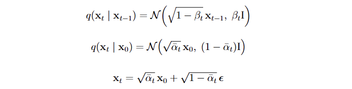
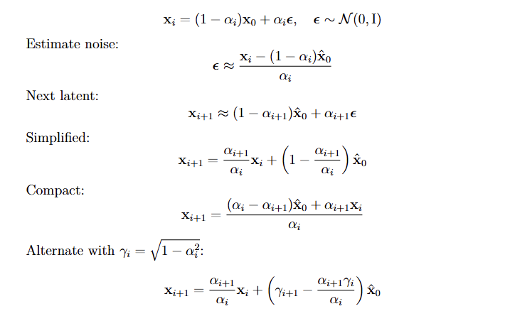

# Building a Latent Diffusion Model from Scratch (PyTorch)
*A friendly walkthrough of the code, the math, and the moving parts.*

---
#Results first

## Why latent diffusion?
Training a diffusion model directly on 512×512 RGB images is expensive. A **latent diffusion model (LDM)** compresses each image into a small latent (here: **4×16×16**), learns to denoise *there*, and uses a pretrained VAE decoder to get back to pixels. That single idea gives you huge speed, smaller models, and far fewer GPU headaches.

This repo/notebook is exactly that: a **from-scratch UNet** that learns to denoise 4×16×16 latents, a tiny bit of attention to make it smart, and a simple sampler. No magic boxes; just the pieces you can read and tweak.

---

## What you’ll find inside
- **A pretrained VAE** (e.g. `stabilityai/sd-vae-ft-ema`) to decode latents back to images.
- **Your UNet, built from scratch**, stitched together by `get_network( )`.
- **Clean helper functions** mirroring your notebook:
  - `sinusoidal_embedding`, `ResidualBlock`, `SpatialAttention`, `CrossAttention`
  - `DownBlock`, `UpBlock`, `get_network`
  - `add_noise`, `dynamic_thresholding`, `Diffuser`
  - I/O helpers like `decode_latents`, `plot_images`

---

## The pipeline at a glance
1) **Images → Latents**: we don’t train the VAE; we reuse a public one. The model sees only **latents** `z ∈ ℝ^{4×16×16}`.  
2) **Forward (noising) process**: for each latent `x₀`, we create a noisy `x_t` at a chosen noise level.  
3) **UNet predicts the clean latent**: given `(x_t, noise_level, text_embedding)`, the UNet predicts `\hat{x}_0` (our estimate of the clean latent).  
4) **Loss**: **MAE** on latents, `|\hat{x}_0 − x_0|`.  
5) **Sampling**: start from noise, step through decreasing noise levels, use the UNet’s guesses, and walk back to a clean latent—then decode with the VAE.

---

## The math (gentle but concrete)

### 1) Forward (noising) process — what we feed the UNet
We use a **noise level** scalar $\alpha \in [0,1]$ and its **signal level** $\gamma = \sqrt{1-\alpha^2}$. For a clean latent $\mathbf{x}_0$ and Gaussian noise $\boldsymbol{\epsilon} \sim \mathcal{N}(0, \mathrm{I})$:

$$
\mathbf{x}_t = \gamma \mathbf{x}_0 + \alpha \boldsymbol{\epsilon}
$$

The helper that implements this is **`add_noise( )`**.

#### Aside: DDPM-style closed form
Let the classic Markov forward process have variances $\beta_t$ with $\alpha_t = 1-\beta_t$ and $\bar{\alpha}_t=\prod_{s=1}^t \alpha_s$. Then

Our scalar **noise level** $\alpha$ can be viewed as a user-friendly proxy for something like $\sqrt{1-\bar{\alpha}_t}$.

---

### 2) Conditioning — how we tell the model “where we are”
- **Noise embedding** (`sinusoidal_embedding`) turns the scalar $\alpha$ into **32 dims** using exponentially spaced frequencies $f_k$:

$$
e(\alpha) = [\sin(2\pi f_1\alpha),\ \cos(2\pi f_1\alpha),\ \ldots,\ \sin(2\pi f_{16}\alpha),\ \cos(2\pi f_{16}\alpha)]
$$

- **Text embedding** is a 512-dim vector (e.g., CLIP/other), projected to **256 dims** by a linear layer.

We tile both across H×W and **concatenate** → a conditioning map with **32 + 256** channels. The UNet reads this map at every spatial location.

---

### 3) The UNet — how it thinks
Built by **`get_network(latent_image_size, block_depth, emb_size, latent_channels)`** from these parts:

- **`ResidualBlock`**: two convs + skip.
- **`SpatialAttention`**: self-attention over positions with standard attention

$$
\mathrm{Attn}(Q,K,V) = \mathrm{softmax}\!\left(\frac{QK^\top}{\sqrt{d_k}}\right)V
$$

- **`CrossAttention`**: **queries from image features**, **keys/values from text conditioning** (or vice versa, depending on your implementation).

---

### 4) Objective — what we optimize
We train to predict the clean latent $\mathbf{x}_0$:

$$
\mathcal{L} = \left\| f_\theta(\mathbf{x}_t, \alpha, y) - \mathbf{x}_0 \right\|_1
$$

---

### 5) Classifier-Free Guidance — how we push toward the text
Use **label dropout (~15%)** during training so the model learns both conditional and unconditional behavior. At sampling, run two passes and blend:

$$
\hat{\mathbf{x}}_0 = w \hat{\mathbf{x}}_0^{(y)} + (1-w)\hat{\mathbf{x}}_0^{(\varnothing)}
$$

with guidance weight $w$ (e.g., `class_guidance=4.0`). Implemented in `Diffuser.predict_x_zero( )`.

---

### 6) Reverse diffusion — how we actually sample
We use a K-step schedule (e.g., **70 steps**). For current $\alpha_i$ and next $\alpha_{i+1}$:

---

### 7) Dynamic thresholding — how we keep predictions sane
Per sample, clip $\hat{\mathbf{x}}_0$ to a high percentile of its absolute values (e.g., 99.5–99.75) and rescale to $[-1,1]$. This prevents rare spikes from derailing images. Implemented in `dynamic_thresholding( )`.

---

## How the pieces map to the code
- **Data & Viz**
  - `decode_latents(latents, std_latent)` — VAE decode (latents → RGB)
  - `plot_images( )`, `imshow( )` — small plotting helpers
- **Math & Noise**
  - `sinusoidal_embedding(noise_levels, emb_dim=32)`
  - `add_noise(array_nhwc)`
  - `dynamic_thresholding(img, perc=99.5)`
- **Model Blocks**
  - `ResidualBlock(in_ch, out_ch)`
  - `SpatialAttention(ch)`
  - `CrossAttention(img_ch, txt_ch)`
  - `DownBlock(in_ch, out_ch, block_depth, cond_ch, use_self_attention=True)`
  - `UpBlock(in_ch, out_ch, block_depth, cond_ch, use_self_attention=True)`
  - `get_network(latent_image_size, block_depth, emb_size, latent_channels)`
- **Sampling**
  - `Diffuser(denoiser, class_guidance, diffusion_steps,  )`
    - `predict_x_zero(x_t, labels, noise_level_scalar)`
    - `reverse_diffusion(seeds_nhwc, labels_np)`

---

## Shapes & defaults (cheat sheet)
| Name | Shape / Value |
|---|---|
| latent `x` | `(B, 4, 16, 16)` (channels-first) or `(B, 16, 16, 4)` (channels-last) |
| text embedding | `(B, 512)` → linear → `(B, 256)` |
| noise embedding | `(B, 32)` |
| UNet hidden widths | 128 → 256 → 512 (down), mirror back up |
| guidance weight `w` | `4.0` (typical) |
| diffusion steps | `70` (example) |

> **GitHub math tips**  
> • One equation = one `$$ $$` block.  
> • No blank lines inside `$$ $$`.  
> • Avoid `\big`, `\Big`, excessive spacing commands; prefer plain `()` or `\left(\right)`.  
> • Use `\mathrm{I}` for identity, `\mathbf{x}` for vectors, `\boldsymbol{\epsilon}` for noise.
